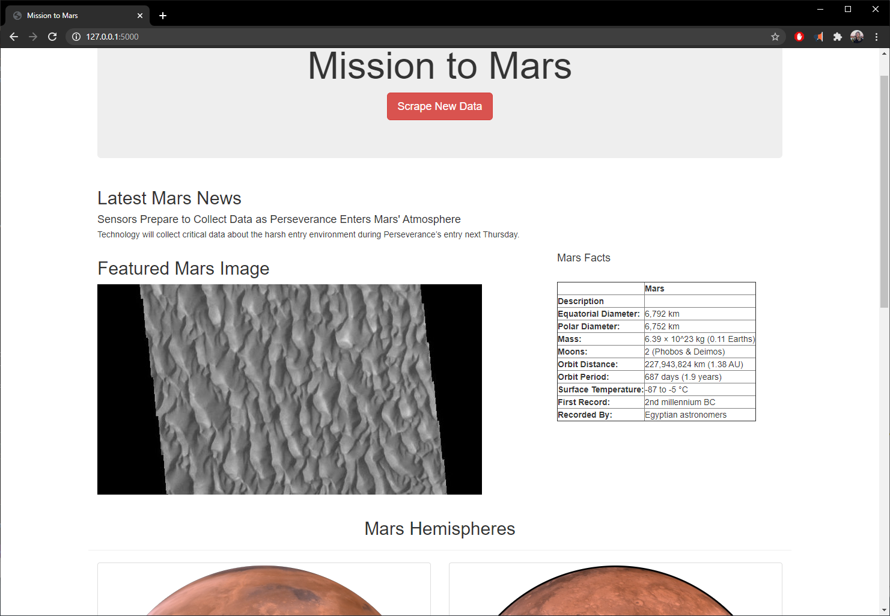

# Mission-to-Mars

The purpose of this project is to provide Robin, a data analyst and other astronauts, with a web app run by Flask in order to web scrape the latest news and images about the mission to Mars. Data is extracted with Splinter and BeautifulSoup, then stored in MongoDB. 

Below is a screenshot of the web app:

